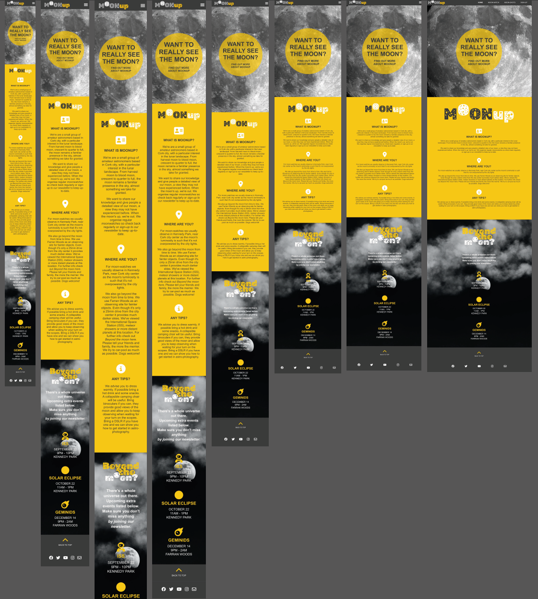
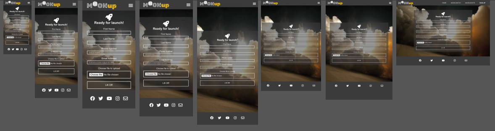
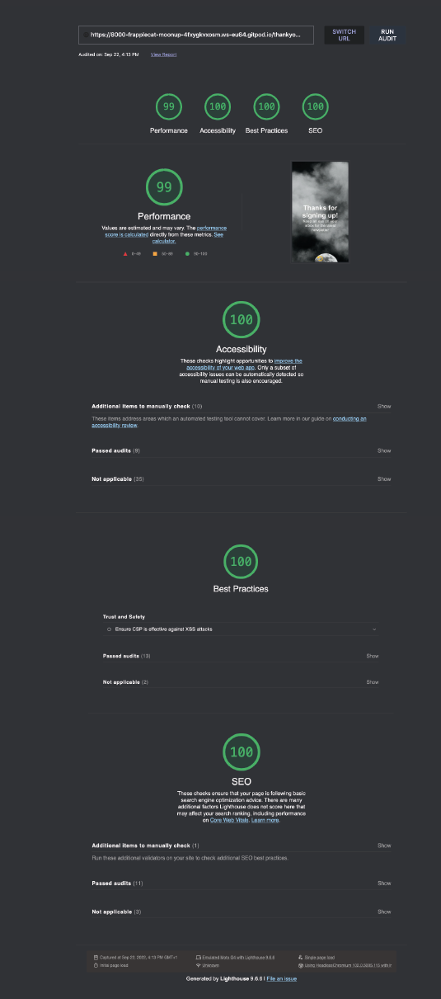

 
 
 

- [ABOUT MOONUP](#aboutmoonup)
- [INITIAL WIREFRAMES](#initial-wireframes)
- [UX (USER-EXPERIENCE)](#ux-user-experience)
  * [KEY INFO](#key-info)
  * [USER STORIES](#user-stories)
- [WEBSITE OVERVIEW](#website-overview)
- [WEBSITE SCROLL THROUGH](#website-scroll-through)
  * [DESKTOP EXAMPLE](#desktop-example)
  * [MOBILE EXAMPLE](#mobile-example)
- [LOGO & HEADINGS](#logo---headings)
- [HOMEPAGE](#homepage)
  * [ABOUT MOONUP SECTION](#about-moonup-section)
  * [BEYOND THE MOON SECTION](#beyond-the-moon-section)
- [NAVIGATION](#navigation)
  * [DESKTOP](#desktop)
  * [MOBILE](#mobile)
  * [FOOTER](#footer)
  * [FAVICON](#favicon)
- [MOONWATCH PAGE](#moonwatch-page)
  * [ABOUT MOONWATCHES SECTION](#about-moonwatches-section)
  * [MOON PHASES SECTION](#moon-phases-section)
- [MOONSHOTS PAGE](#moonshots-page)
- [SIGN-UP PAGE](#sign-up-page)
- [CONTACT US POP-UP](#contact-us-pop-up)
- [MAPS PAGE](#maps-page)
- [RESPONSIVENESS](#responsiveness)
- [LANGUAGES USED](#languages-used)
- [VALIDATOR TESTING](#validator-testing)
  * [HTML](#html)
  * [CSS](#css)
  * [LIGHTHOUSE](#lighthouse)
  * [COLOUR](#colour)
- [BUGS](#bugs)
- [DEPLOYMENT](#deployment)
- [CREDITS](#credits)
- [CONTENT](#content)
- [CODE](#code)
  * [LOVE RUNNING](#love-running)
  * [HAMBURGER MENU CODE](#hamburger-menu-code)
  * [WHITE TEXT APPEARS BOLDER](#white-text-appears-bolder)
  * [CENTERING ISSUE](#centering-issue)
  * [TABLE OF CONTENTS](#table-of-contents)
  * [PLACEHOLDER](#placeholder)
- [MEDIA](#media)

 
 
 

# ABOUT MOONup

MOONup is a website created for a small group of amateur astronomers based in Cork city who wish to share their knowledge with as wide a range of people as possible. 
Astronomy can be appear intimidating to a novice, they'd like to change that.
They're focused on the moon because, as our nearest celestial neighbour, it's something everyone is familiar with, it's visible from most sites throughout the year
and can be enjoyed just by eye or a standard pair of binoculars. However they've found that the moon can be taken for granted, even by people who already have a passing interest in the night sky, but it doesn't take much to change that mindset. When viewed through a telescope the usual response is just: WOW! The aim of the website is to develop a community, build-up numbers and get lots of sign-ups to the newsletter. Over time the moonshots page will contain more pictures from attendees and from the various moonwatches, meet-ups and other events.

 
 
 

# INITIAL WIREFRAMES
* Rough wireframes created in Balsamiq

 
 
 

# UX (USER-EXPERIENCE)

## KEY INFO
* Tell the user about MOONup
* How to take part
* Upcoming events. What type of event, when and where they take place
* How to get to the event sites
* Sign-up to the MOONup newsletter
* Add astrophotography or event photos to the moonshots gallery
* Contact with any queries
* Links to social media feeds

## USER STORIES

### VISITOR GOALS
* For the site to be easily navigable and look appealing on a range of screen sizes and devices
* To make it easy for people to find out more information about MOONup and what they do
* For it to be easy to ask questions or find when the next events are on

### FIRST TIME VISITOR GOALS

* I want to be able to find out more about MOONup
* I want to be able to navigate around the site in a logical way
* I want to be able to find any social media feeds
* I want to be able to ask some questions
* I want to be kept up-to-date on events

### RETURNING VISITOR GOALS

* I want to be able to ask more questions or make suggestions
* I want to be kept up-to-date on events
* I want to upload some photos to the moonshots gallery

 
 
 

# WEBSITE OVERVIEW
I wanted to keep a simple, clean layout. I removed some headings above the fold section from my original wireframes as I thought it looked too busy on the page, especially when I started resizing to mobile screen sizes. I chose a colour scheme that complemented the lunar theme with whites and greys mainly but with a yellow, from the occasional yellow moon, to add a splash of colour and interest. This signature colour could be easily changed to suit any unusual lunar activity throughout the year e.g. when there's a blue or red moon.

 
 
 

# LOGO & HEADINGS
* I created the logo and headings in Adobe Illustrator, outlined the Rubik Moonrocks font, and exported as .svg

 
 
 
 

 
 
 

# HOMEPAGE

* The main page is an image of a full moon, animated so it zooms in to tie-in with the main heading's simple question that will hopefully intrigue and get the viewer to explore the rest of the page.
* The main heading is in a circular container to keep with the moon theme and the yellow is eye-catching against the white/grey/black lunar colour scheme.

 
 
 

## ABOUT MOONUP SECTION

 
* The about MOONup section will briefly explain the groups goals, where they meet, what's needed for an attendee.
* Also includes some links in the text content to other sections or pages with more detail.

 
 
 

## BEYOND THE MOON SECTION

* The beyond the moon section will briefly expand on what else MOONup can show people and provide dates and locations of some upcoming events.
* This section will be updated as events are completed and when new events are added through the year. 

 
 
 

# NAVIGATION
## DESKTOP

* MOONup logo on left that always links to home page. 
* Links to other pages on right.
* Bold white on active.
* Yellow and bold on hover.

## MOBILE

* Collapses to hamburger menu at smaller sizes.

## FOOTER

* Twitter, Facebook, Instagram, YouTube in the footer along with a contact us link. 
* Turns yellow on hover.
* All open in new windows.

* Added a Back To Top link above the footer.

## FAVICON

 
 
 

# MOONWATCH PAGE

* To keep the them consistent the moonwatch page is similar in style to the homepage but with a new image and no animation. 
* Another simple question for the main heading that will lead the viewer to explore the rest of the page.

 
 
 

## ABOUT MOONWATCHES SECTION

* The why, where and how but without being overly complicated. 
* It will also have information about the upcoming moonwatches. 
* This section will be updated as moonwatches are completed and when new moonwatches are added through the year.

 
 
 

## MOON PHASES SECTION

* A simple calendar showing the Moon Phases for the remainder of the year and into 2023.

 
 
 

# MOONSHOTS PAGE

* A gallery style page that will expand over time when attendees send in their own images after events are completed. 

 
 
 

# SIGN UP PAGE

* This page is where people will sign up to the MOONup newsletter so they can be notified of all the latest events and see photos and details of previous events. 
* As well as signing-up the user can also upload any images for the Moonshots gallery. 
* The user will be requested to submit their full name, email and mobile number.
* All fields have a placeholder showing the format required for entry.

 
 
 

* Used the Code Institute form-dump details for testing but it was mentioned on Slack that it'd be better practice to change to a Thanks page after confirming it worked.

 
 
 

# CONTACT US POP-UP

* Nested in the footer with the social media links is a contact us link. 
* Opens in a new page.
* Contains a text area for any questions or messages the user may have for MOONup.

* As on the Signup page I used the Code Institute form-dump details for testing but changed to a Thanks page after confirming it worked.

 
 
 

# MAPS Page

* Just some embedded Google maps showing the 2 main locations used for observing.
* Not a page in the navigation bar but has links to get you back to the main content.

 
 
 

# RESPONSIVENESS 

* screenshots for widths 360px, 375px, 390px, 412px, 600px, 820px, 912px & 1280px (Samsung Galaxy S8+, iPhone SE, iPhone12 Pro, Galaxy S20 Ultra, Blackberry PlayBook, iPad Air, Surface Pro7 & Nest Hub Max)

 
 
 

# TECHNOLOGIES USED

## LANGUAGES USED

* HTML
* CSS
* MARKDOWN

## FRAMEWORKS, LIBRARIES & PROGRAMS USED

* BALSAMIQ - to create wireframe website mockups
* GITPOD - to create the website and version control
* GITHUB - to save and store the files for the website
* ADOBE ILLUSTRATOR - to create the logo and various headings
* ADOBE INDESIGN - ran the readme text through InDesign's spellchecker
* AM I RESPONSIVE - to display the website on a range of devices
* FONT AWESOME - for icons
* FAVICON.IO -  to create a favicon
* CONVERTIO.CO - to change jpgs to webp format
* BULK RESIZE PHOTOS - to resize webp images
* PEXELS.COM - for stock images
* PIXABAY.COM - for stock images
* GOOGLE DEV TOOLS - for troubleshooting and testing fixes
* W3C HTML & CSS VALIDATORS - to test HTML and CSS code
* SLACK, STACKOVERFLOW, YOUTUBE, GOOGLE, W3C Schools - for help with troubleshooting errors
* COOLORS.CO - to check colour contrast
* W3C SPELL CHECKER - to check website spelling
* CLOUDCONVERT.COM - to change mp4 to gif for README

 
 
 

# VALIDATOR TESTING

## HTML

* No errors were returned when passing through the official W3C validator.

## CSS

* No errors were found when passing through the official (Jigsaw) validator

 
 
 

## LIGHTHOUSE

 
 
 

## COLOUR

* I used coolors.co to check the contrast levels of the colour palette selected.

https://coolors.co/contrast-checker/112a46-acc8e5

 
 
 

# BUGS

* In the sign-up section the phone number field has a placeholder showing the format required for entry. Had a 3 3 4 ([0-9]{3} [0-9]{3} [0-9]{4}) format initially 
but on some mobiles the spaces weren't allowed so switched to 0000000000 ([0-9]{10}) instead.

* The white text on #3a3a3a background seemed bolder in certain browsers. From what I could find researching the problem it seems to be linked to font smoothing, may just be a mac issue as well.
Screenshot below showing before and after -webkit-font-smoothing: antialiased; applied.
Viewed using Chrome on iMac.

* As of June 23, 2020, all major browsers — Chrome, Edge, Firefox & Safari (14+) — support the WebP format but I've noticed that it doesn't work on older versions of MacOs/Safari. I was going to try and set up a fallback using jpgs for these older OSs. The picture tag was recommended as a solution e.g.

        <picture>
            <source type="image/webp" srcset="assets/images/full-moon-silhouetted-branches-david-dibert 720px.webp">
            <source type="image/jpg" srcset="assets/images/full-moon-silhouetted-branches-david-dibert.jpg">
            
          </picture>    

I had some difficulty getting it to work though, with the jpg over-riding the webp in all instances. I discussed with a Code Institute Tutor and they suggested just sticking with webp as: There has to come a point where older browsers aren't developed for anymore and webp has been around for some time now. Most of the world is using a Chromium based browser or Firefox.

* I had some hassle with centering on the sign-up page, used the code below to fix the problem. 
https://medium.com/swlh/how-well-do-you-know-css-52290217ff6e

    top: 50%;
    left: 50%;
    margin-right: -50%;
    transform: translate(-50%, -50%)

* I noticed my MOONup.svg logo wasn't displaying on Firefox and Safari. Fixed by defining the height.

* The hamburger menu was opening underneath the hero images on each page. Fixed by giving a z-index to the item.

* The placeholder text was very faint in some of the fields on the signup page. Changed the colour of the placeholder using some code from w3schools.
https://www.w3schools.com/howto/howto_css_placeholder.asp

* Couldn't get signup page to fit neatly on a range of mobile screens. I was trying to eliminate the need for much if any scrolling to the footer by using max-width queries.
Added max-height queries to help resolve it. It worked but led to the form position moving a fraction and overlaying the logo slightly. Add a small position change to the
max-height query in question to compensate.

* Used <em></em> tags to highlight some links within para content, noticed they weren't working on certain browsers. Applied em {font-style: italic;} in CSS to correct.

 
 
 

# DEPLOYMENT

* The site was deployed to GitHub pages 

* The steps to deploy are as follows:
* Go to GitHub and select the repository for the project
* Navigate to the Settings tab
* Select Pages from the left hand navigation window
* Select deploy from a branch under the source drop-down menu
* Select main from the branch dropdown menu and press save
* The site has now been deployed but please note that the process may take a few minutes before the site goes live
* A detailed ribbon display will indicate the successful deployment.
* The live link can be found here:

 
 
 

# CREDITS

* Thanks to Code Institute Tutors Oisín and Scott for their advice on a couple of issues.
* Thanks to Kera Cudmore for her talk on creating README files
* Big thank you to my CI Mentor, Mitko Bachvarov, for his support, excellent advice and eagle eye for detail.

 
 
 

# CONTENT

The paras on Binoculars and Telescopes on the moonwatches page were taken from the NASA website section on observing the moon.

 
 
 

# CODE

## LOVE RUNNING
* I based a lot of the layout on the Code Institute Love Running initially. I changed the hero zoom slightly to better suit what I wanted.
* I moved away from the Floats to a Flex model which seemed to work better for me especially when making the site responsive. Thanks again to CI Tutor, Oisin,
for pointing me in that direction to fix a centering issue. 
* I found this youtube video by Luke Peters very instructive as well with regard to responsive columns: https://www.youtube.com/watch?v=-pcMxrugSbs 

## HAMBURGER MENU CODE
https://alvarotrigo.com/blog/hamburger-menu-css/

* This was an excellent run-through of various style and options. I adapted one of them so it extended a bit further into the page and didn't partially block my logo
Also amended the colours and removed some lines.

## WHITE TEXT APPEARS BOLDER
https://stackoverflow.com/questions/14477265/css-white-text-on-black-background-looks-bolder

body {
-moz-font-smoothing: antialiased;
-o-font-smoothing: antialiased;
-moz-osx-font-smoothing: grayscale;
-webkit-font-smoothing: antialiased;
}

* I found the above or variations thereof in a few places but used the one from a stackoverflow chat. The last one of the four is the one that seems to work.

## CENTERING ISSUE
https://medium.com/swlh/how-well-do-you-know-css-52290217ff6e

    top: 50%;
    left: 50%;
    margin-right: -50%;
    transform: translate(-50%, -50%)

* I had some hassle with centering on the sign-up page, used the above code to fix the problem. 

## TABLE OF CONTENTS
* <small><i><a href='http://ecotrust-canada.github.io/markdown-toc/'>Table of contents generated with markdown-toc</a></i></small>

## PLACEHOLDER
Changed the colour of the placeholder using some code from w3schools, adapted to suit my colour palette.
https://www.w3schools.com/howto/howto_css_placeholder.asp

 
 
 

# MEDIA

* The photos used throughout were mainly sourced from Pexels.com with some from Pixabay.com. I've kept the photographers names in the alt description when available.
* Photos converted from jpg to webp using https://convertio.co/jpg-webp/
* Photos resized using https://bulkresizephotos.com/en