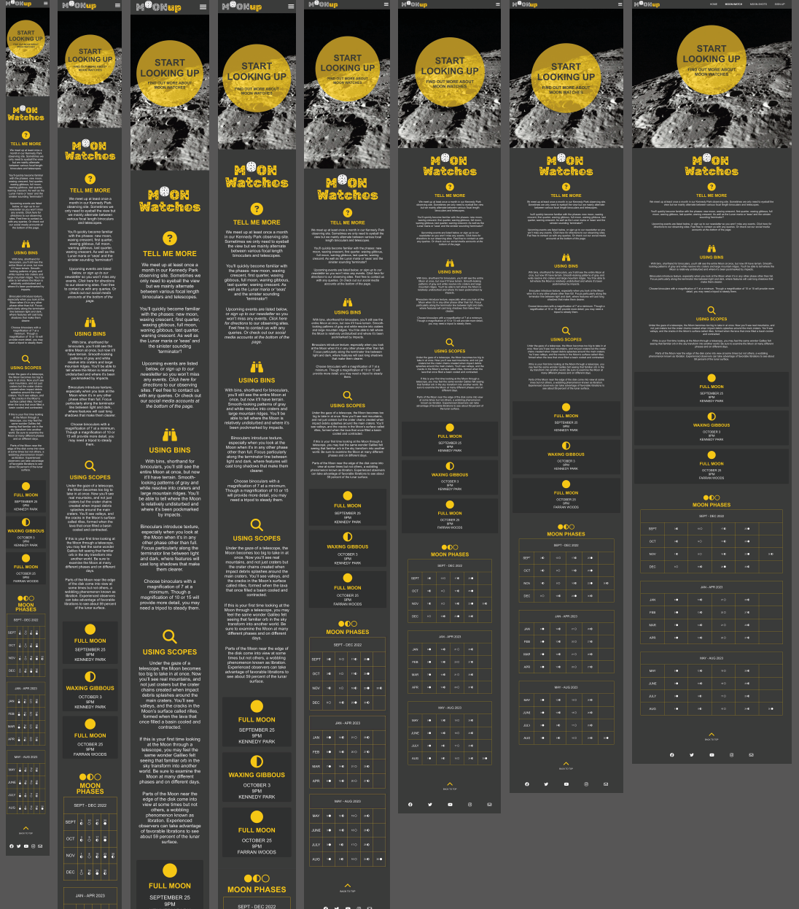

 
 
 

- [INITIAL WIREFRAMES](#initial-wireframes)
- [WEBSITE OVERVIEW](#website-overview)
- [LOGO & HEADINGS](#logo---headings)
- [HOMEPAGE](#homepage)
  * [ABOUT MOONUP SECTION](#about-moonup-section)
  * [BEYOND THE MOON SECTION](#beyond-the-moon-section)
- [NAVIGATION](#navigation)
  * [DESKTOP](#desktop)
  * [MOBILE](#mobile)
  * [FOOTER](#footer)
- [MOON WATCH PAGE](#moon-watch-page)
  * [ABOUT MOON WATCHES SECTION](#about-moon-watches-section)
  * [MOON PHASES SECTION](#moon-phases-section)
- [MOON SHOTS PAGE](#moon-shots-page)
- [SIGN-UP PAGE](#sign-up-page)
- [CONTACT US POP-UP](#contact-us-pop-up)
- [MAPS POP-UP](#maps-pop-up)
- [RESPONSIVENESS](#responsiveness)
- [LANGUAGES USED](#languages-used)
- [VALIDATOR TESTING](#validator-testing)
- [BUGS](#bugs)
- [DEPLOYMENT](#deployment)
- [CREDITS](#credits)
- [CONTENT](#content)
- [CODE](#code)
  * [Love Running](#love-running)
  * [Hamburger Menu Code](#hamburger-menu-code)
  * [White font appears bolder](#white-font-appears-bolder)
  * [Centering Issue](#centering-issue)
- [MEDIA](#media)

 
 
 

# ABOUT MOONUP

MOONup is a website created for a small group of amateur astronomers based in Cork city who wish to share their knowledge with as wide a range of people as possible. 
Astromomy can be appear intimidating to a novice, they'd like to change that.
They're focused on the moon because, as our nearest celestial neighbour, it's something everyone is familiar with, it's visible from any site thoughout the year
and can be enjoyed just by eye or a standard pair of binoculars. However they've found that the moon can be taken for granted, even by people who already have a passing interest in the night sky, but it deosn't take much to change that mindset. When viewed through a telescope the usual response is just: WOW! The aim of the website is to hopefully develop a community, build-up numbers and get lots of sign-ups to the newsletter. Over time the moon-shots page will contain more pictures from attendees and from the various moon watches and meet-ups.

 
 
 

# INITIAL WIREFRAMES
* Rough wireframes created in Balsamiq

 
 
 

# WEBSITE OVERVIEW
I wanted to keep a simple, clean layout. I removed some headings above the fold section from my original wireframes as I thought it looked too busy on the page, especially when I started resizing to mobile screen sizes. I chose a colour scheme that complemented the lunar theme with whites and greys mainly but with a yellow, from the occasional yellow moon, to add a pop of colour and interest. This signature colour could be easily changed to suit any unusual lunar activity throughout the year e.g. when there's a blue or red moon.

 
 
 

# LOGO & HEADINGS
* I created the logo and headings in Adobe Illustrator, outlining the Rubik Moonrocks font, and exported as .svg

 
 
 
 

 
 
 

# HOMEPAGE

* The main page is an images of the full moon, animated so it zooms in to tie in with the main heading's simple question that will hopefully intrigue and get the viewer to explore the rest of the page.
* The main heading is in a circular container to keep with the moon theme and the yellow is eyecatching against the white/grey/black lunar colour scheme.

 
 
 

## ABOUT MOONUP SECTION

 
* The about moonup section will briefly explain about moonup, where they meet, what's needed.
* Also includes some links in the text content to other sections or pages with more detail.

 
 
 

## BEYOND THE MOON SECTION

* The beyond the moon section will briefly expand on what else moonup can show people and provide dates and locations or some upcoming events.
* This section will be updated as events are completed and when new events are added through the year. 

 
 
 

# NAVIGATION
## DESKTOP

* MOONup logo on left that always links to home page. 
* Links to other pages on right.
* Bold white on active.
* Yellow and bold on hover.

## MOBILE
  
* Collapses to hamburger menu at smaller sizes.

## FOOTER

* Twitter, Facebook, Instagram, Youtube in the footer along with a contact us link. 
* Turns yellow on hover.
* All open in new windows.

* Also added a Back To Top link above the footer.

 
 
 

# MOON WATCH PAGE

* To keep the them consistent the moon watch page is similar in style to the homepage but with a new image and no animation. 
* Another simple question for the main heading that will lead the viewer to explore the rest of the page.

 
 
 

## ABOUT MOON WATCHES SECTION

* The why, where and how but without being overly complicated. 
* It will also have information about the upcoming moon watches. 
* This section will be updated as moon watches are completed and when new moon watches are added through the year.

 
 
 

## MOON PHASES SECTION

* A simple calendar showing the Moon Phases for the remainder of the year and into 2023.

 
 
 

# MOON SHOTS PAGE

* A gallery style page that will expand over time and more people send in their own images and more events are completed. 

 
 
 

# SIGN-UP PAGE

* This page is where people will sign-up to the MOONup newsletter so they can be notified of all the latest events and see photos and details of previous events. 
* As well as signing-up the user can also upload any images for the Moon shots gallery. 
* The user will be requested to submit their full name, email and mobile number.
* Phone number field has a placeholder showing the format required for entry. Had a 3 3 4 ([0-9]{3} [0-9]{3} [0-9]{4}) format initially but on some mobiles the spaces weren't allowed so switched to 0000000000 ([0-9]{10}) instead.

 
 
 

* Used the Code Institute form-dump details for testing but it was mentioned on Slack that it'd be better practice to change to a Thanks page after confirming it worked.

 
 
 

# CONTACT US POP-UP

* Nested in the footer with the scoial media links is a contact us link. 
* Opens in a new page.
* Contains a text area for any questions or messages the user may have for MOONup.

* As on the Sign-up page I used the Code Institute form-dump details for testing but changed to a Thanks page after confirming it worked.

 
 
 

# MAPS POP-UP

* Opens in a separate page, just some embedded google maps showing the 2 main locations used for observing.

 
 
 

# RESPONSIVENESS 

* screenshots for widths 820px, 412px, 375px & 360px (iPad Air, iPhone SE, Galaxy S20 Ultra, Samsung Galaxy S8+)

 
 
 

# LANGUAGES USED

* HTML
* CSS

 
 
 

# VALIDATOR TESTING

* No errors were returned when passing through the official W3C validator.
* Also included web dev lighthouse results.

CSS

* No errors were found when passing through the official (Jigsaw) validator

 
 
 

# BUGS

* As noted above, in the sign-up section the phone number field has a placeholder showing the format required for entry. Had a 3 3 4 ([0-9]{3} [0-9]{3} [0-9]{4}) format initially 
but on some mobiles the spaces weren't allowed so switched to 0000000000 ([0-9]{10}) instead.

* The white text on #3a3a3a background seemed bolder in certain browsers. From what I could find researching the problem it seems to be linked to font smoothing, may just be a mac issue as well.
Screenshot below showing before and after -webkit-font-smoothing: antialiased; applied.
Viewed using Chrome on iMac.

* As of June 23, 2020, all major browsers — Chrome, Edge, Firefox & Safari (14+) — support the WebP format but I've noticed that it doesn't work on older verions of MacOs/Safari. I was going to try and set up a fallback using jpgs for these older OSs. The
picture tag was reccommded as a solution e.g.

        <picture>
            <source type="image/webp" srcset="assets/images/full-moon-silhouetted-branches-david-dibert 720px.webp">
            <source type="image/jpg" srcset="assets/images/full-moon-silhouetted-branches-david-dibert.jpg">
            
          </picture>    

* I had some difficulty getting it to work though, with the jpg over-riding the webp in all instances. I discussed with a Code Institute Tutor and the suggested just sticking with webp as: There has to come a point where older browsers aren't developed for anymore and webp has been around for some time now. Most of the world is using a Chromium based browser or Firefox. I might revisit if required or just out of curiosity to see it working.

* I had some hassle with centering on the sign-up page, used the code below to fix the problem. 
https://medium.com/swlh/how-well-do-you-know-css-52290217ff6e

    top: 50%;
    left: 50%;
    margin-right: -50%;
    transform: translate(-50%, -50%)

* noticed my MOONup.svg logo wasn't displaying on certain browsers like Firefox. Fixed by defining the height.

 
 
 

# DEPLOYMENT

* The site was deployed to GitHub pages 

* The steps to deploy are as follows:
* Go to GitHub repository
* Navigate to the Settings tab
* Select source section drop-down menu
* Select the Master Branch
* Once the master branch has been selected, the page will be automatically refreshed 
* A detailed ribbon display will indicate the successful deployment.
* The live link can be found here:

 
 
 

# CREDITS

 
 
 

# CONTENT

The paras on Binoculars and Telescopes were taken from the NASA website section on observing the moon.

 
 
 

# CODE

## Love Running
* I based a lot of the layout on the Code Institute Love Running initially. I changed the hero zoom slightly to better suit what I wanted.
* I moved away from the Floats to a Flex model which seemed to work better for me especially when making the site responsive. Thanks to Code Institute Tutor, Oisin,
for pointing me in that direction to fix a centering issue. I found this youtube video by Luke Peters very instructive as well with regard to 
responsive columns: https://www.youtube.com/watch?v=-pcMxrugSbs 

## Hamburger Menu Code
https://alvarotrigo.com/blog/hamburger-menu-css/

* This was an excellent run through various style and option. I adpated one of the options so it extended a bit further into the page so it didn't partially block my logo
and also amended the colours and romved some lines.

## White font appears bolder
https://stackoverflow.com/questions/14477265/css-white-text-on-black-background-looks-bolder

body {
-moz-font-smoothing: antialiased;
-o-font-smoothing: antialiased;
-moz-osx-font-smoothing: grayscale;
-webkit-font-smoothing: antialiased;
}

* I found the above or variation thereof in a few places but used the one form a stackoverflow chat. The last one of the four is the one that seems to work.

## Centering Issue
https://medium.com/swlh/how-well-do-you-know-css-52290217ff6e

    top: 50%;
    left: 50%;
    margin-right: -50%;
    transform: translate(-50%, -50%)

* I had some hassle with centering on the sign-up page, used the above code to fix the problem. 

# Table of Contents
* <small><i><a href='http://ecotrust-canada.github.io/markdown-toc/'>Table of contents generated with markdown-toc</a></i></small>

 
 
 

# MEDIA

* The photos used throughout were mainly sourced from Pexels.com with some from Pixabay.com. I've kept the photographers names in the alt description when available.
* photos converted from jpg to webp using https://convertio.co/jpg-webp/
* photos resized using https://bulkresizephotos.com/en