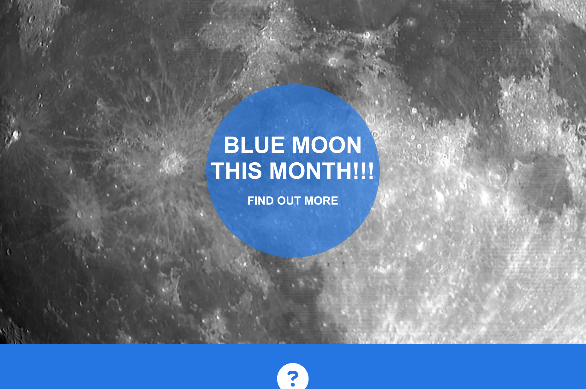

# About MoonUp

MoonUp is a website created for a small group of amateur astronomers based in Cork city who wish to share their knowledge with as wide a range of people as possible. 
Parts of astromomy and the night sky are a quite niche or exclusive hobby to many people and can be appear intimidating to a novice, we'd like to change that.
We're focused on the moon becuase, as our nearest celestial neighbour, it's something everyone is familiar with and it's visible from any site thoughout the year
and can be enjoyed just by eye or a standard pair of binoculars. We've found that the moon can be taken for granted even by people who already have a passing interest in the
night sky but it deosn't take much to change that mindset. When viewed through a telescope the usual response is just: WOW! The aim of the website is to hopefully develop
a community, build up numbers and get lots of sign-up to the newsletter. Overtime the moon-shots page will contain more pictures from attendees and from the various moon watches
and over meet-ups.

# Initial Wireframes

# Website Features
I wanted to keep a nice and clean layout. I removed some headings from my original above the fold section wireframes as I thought it looked too busy on the page, especially when I started resizing to mobile screen sizes. I chose a colour scheme that complemented the lunar theme with whites and greys mainly but with a yellow, from the occasional yellow moon, to add a pop of colour and interest. This signature colour could be easily changed to suit any unusual lunar activity throughout the year e.g. when there's a blue or red moon.

## Homepage

The main page is an images of the full moon, animated so it zooms in to tie in with the main heading's simple question that will hopefully intrigue and get the viewer to explore the rest of the page.
The main heading is in a circular container to keep with the moon theme and the yellow is eyecatching against the white/grey/black lunar colour scheme.

About moonup section 
The about moonup section will briefly explain about moonup, where the meet and what's needed and include some links in the text content to other sections or pages with more detail.

Beyond the moon section 
The beyond the moon section will briefly expand on what else moonup can show people and provide dates and locations or some upcoming events.
This section will be updated as events are completed and when new events are added through the year. 

### Navigation
### Footer
## Moon watch page

To keep the them consistent the moon watch page is similar in style to the homepage but with a new image and no animation. Another simple question for the main heading that will hopefully intrigue and get the viewer to explore the rest of the page.

About moon watches section 
The about moon watches section will briefly explain about the moon watches. The why, where and how but with being overly complicated. It will also have information about the upcoming moon watches: Where, When, What phase of moon. This section will be updated as moon watches are completed and when new moon watches are added through the year. Below this there is a simple calendar showing the Moon Phases (full, new)
for the reaminder of the year and into 2023.

## Moon shots page

A gallery style page that will expand over time and more people send in their own images and more events are completed. 

## Sign-up page

This page is where people will sign-up to the MoonUp newsletter so they can be notified of all the latest events. The user can specify how they'd like to receive updates and can also upload any images for the 
Moon shots gallery. The user will be requested to submit their full name, email and mobile number.

## Contact Us page

## Maps page

## Languages Used
Html
CSS

## Validator Testing

In this section, you need to convince the assessor that you have conducted enough testing to legitimately believe that the site works well. Essentially, in this part you will want to go over all of your project’s features and ensure that they all work as intended, with the project providing an easy and straightforward way for the users to achieve their goals.

In addition, you should mention in this section how your project looks and works on different browsers and screen sizes.

You should also mention in this section any interesting bugs or problems you discovered during your testing, even if you haven't addressed them yet.

If this section grows too long, you may want to split it off into a separate file and link to it from here.

Validator Testing
HTML
No errors were returned when passing through the official W3C validator
CSS
No errors were found when passing through the official (Jigsaw) validator

## Bugs

## Deployment

The site was deployed to GitHub pages. The steps to deploy are as follows:
In the GitHub repository, navigate to the Settings tab
From the source section drop-down menu, select the Master Branch
Once the master branch has been selected, the page will be automatically refreshed with a detailed ribbon display to indicate the successful deployment.
The live link can be found here - https://code-institute-org.github.io/love-running-2.0/index.html

## Credits

Thanks to Oisin in Code Institute

### Content

The text for the Home page was taken from Wikipedia Article A
Instructions on how to implement form validation on the Sign Up page was taken from Specific YouTube Tutorial
The icons in the footer were taken from Font Awesome

### Code

The text for the Home page was taken from Wikipedia Article A
Instructions on how to implement form validation on the Sign Up page was taken from Specific YouTube Tutorial

### Media

The photos used throughout were mainly sourced from Pexels.com with some from Pixabay.com.

